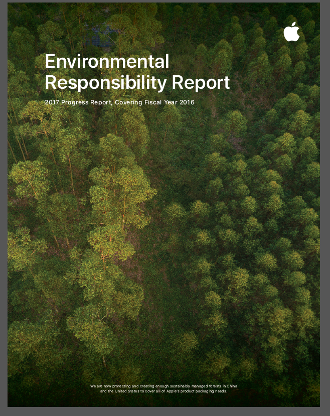
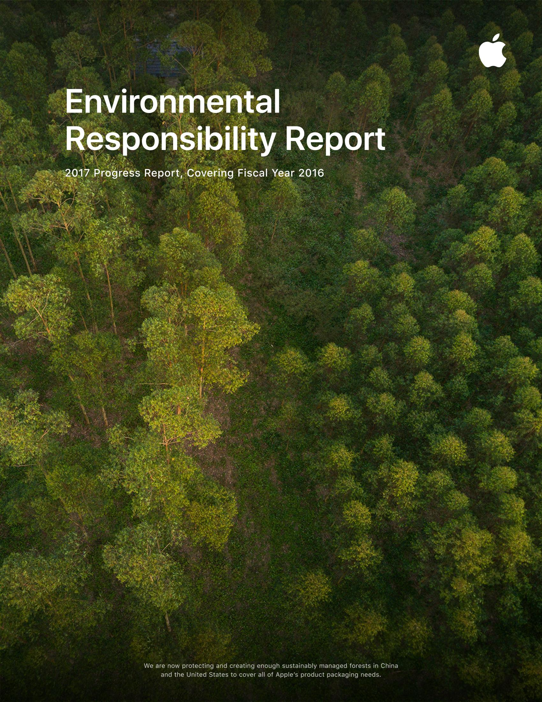
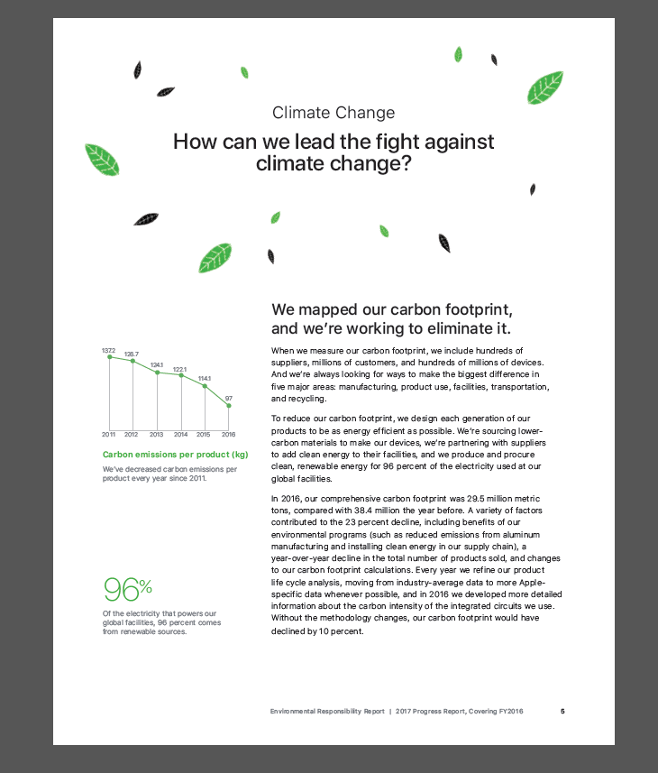
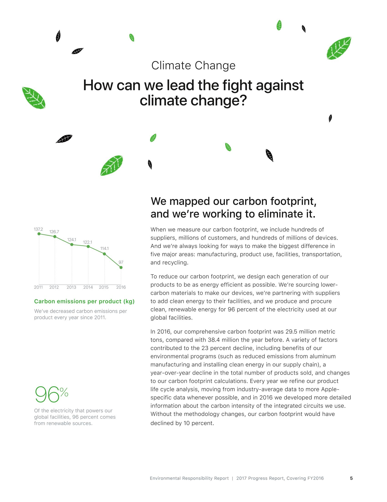
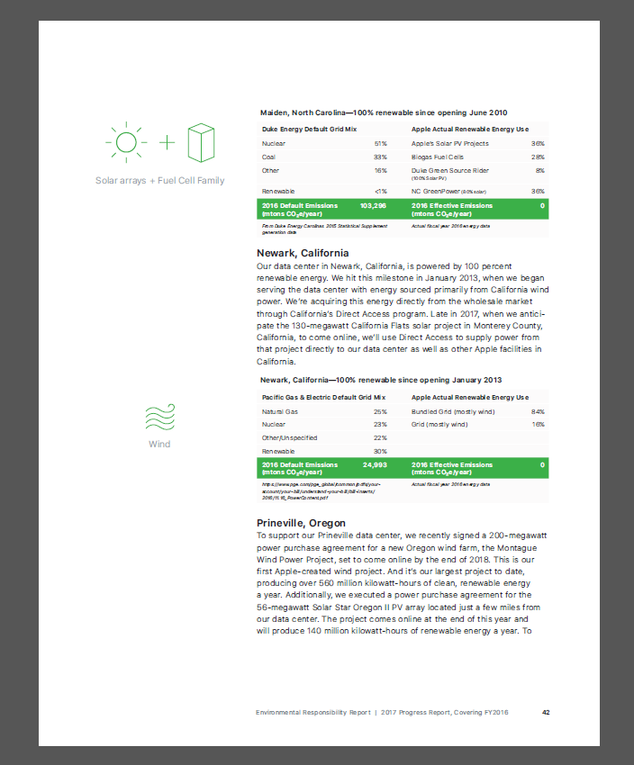
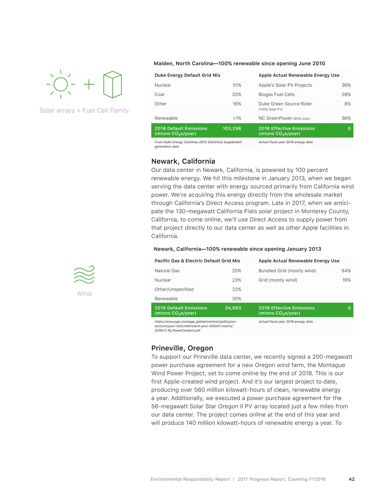
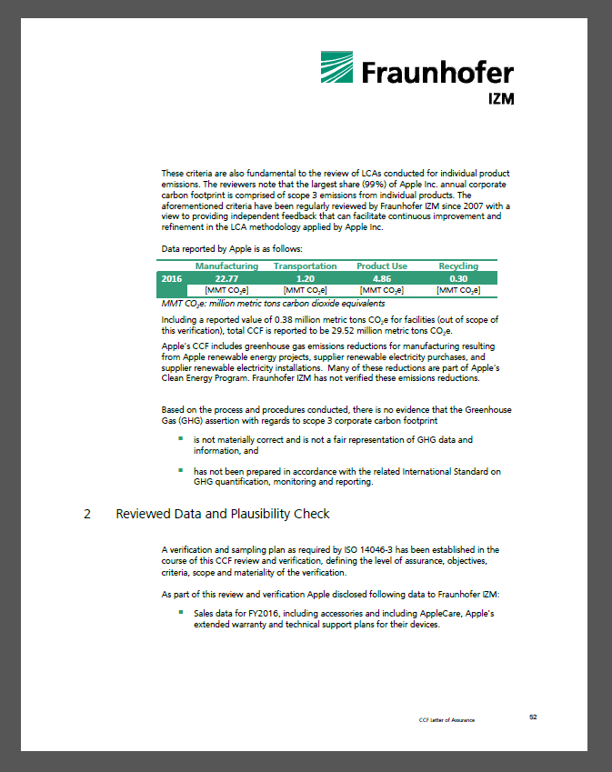
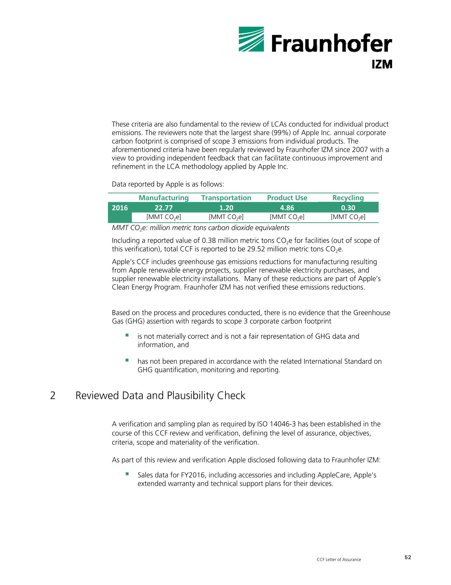

# PDF To Images
This method renders PDF files and draws them into image file list objects, a different concept from [Apache POI](https://poi.apache.org/). 

An example is made based on [Apache PDFBox](https://pdfbox.apache.org/).

## How to use?
[1] include Add PDFBox dependency to the pom.xml.

	<dependencies>
		<!-- https://mvnrepository.com/artifact/org.apache.pdfbox/pdfbox -->
		<dependency>
			<groupId>org.apache.pdfbox</groupId>
			<artifactId>pdfbox</artifactId>
			<version>2.0.8</version>
		</dependency>
	</dependencies>

[2] Leverage ConvertPdfToImage function of ConvertUtil.

	File pdf = new File("D:/20180222/test.pdf");
    List<File> imageList = ConvertUtil.convertPdfToImage(pdf); // images files
    
# Example
For example, we used the [Apple _ Environmental _ Responsibility_Report_2007.pdf](https://images.apple.com/environment/pdf/Apple_Environmental_Responsibility_Report_2017.pdf).

## [1] Slide 1
This is Original Capture (PDF capture to PNG)

This is Rendered image (JPG)

## [2] Slide 5
This is Original Capture (PDF capture to PNG)

This is Rendered image (JPG)

## [3] Slide 42
This is Original Capture (PDF capture to PNG)

This is Rendered image (JPG)

## [3] Slide 52
This is Original Capture (PDF capture to PNG)

This is Rendered image (JPG)
